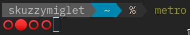

# metro - terminal metronome

Terminal metronome, written in Go.
Created out of frustration of terrible online ones, and to save you from the ad-ridden Android apps.

## Install

Just `go get github.com/skuzzymiglet/metro`. A tabla sample is embedded by default (using [pkger](https://github.com/markbates/pkger)) - you can specify any soundfile if you want.

## Usage

+ Change the BPM with `-t`
+ Change the number of beats with `-b`
+ Change the sample with `-f` 
+ Change the symbol for the current beat with `-o`, and for the other beats with `-O` 

_Subject to change_

## Planned features

+ On-the-fly tempo changing
+ Multiple view modes for eyecandy
+ Adjust number of bars played
+ Tapping the tempo
+ Set strong and weak beats
+ Sample lasts for 1 bar (i.e. loops)
+ Change tempo for some bars
+ Italian tempo names
+ Cut/pad **as well as** resampling
+ Polyrhythms/subdivisions of beats
+ MIDI output
